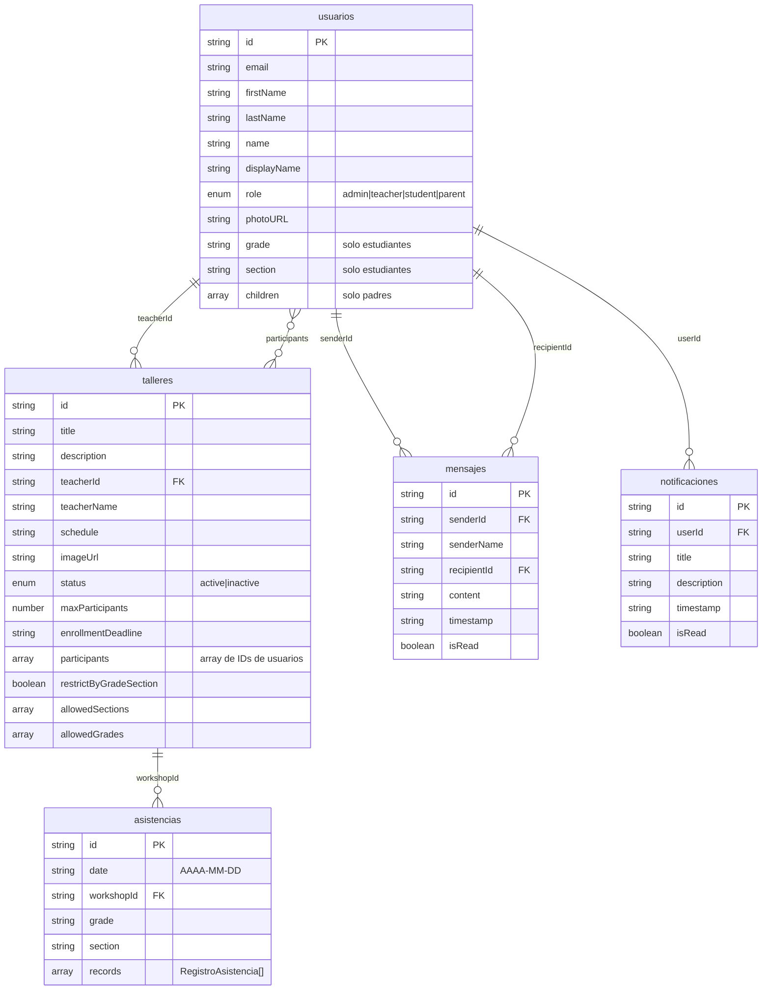

# Diagrama de Base de Datos - SIGTE

## Modelo de Datos en Firestore



## Descripción de Colecciones

### 📁 usuarios (users)
Almacena todos los usuarios del sistema (administradores, profesores, estudiantes y padres).

**Campos principales:**
- `id`: Identificador único del usuario (coincide con UID de Firebase Auth)
- `email`: Correo electrónico del usuario
- `firstName`: Nombre(s) del usuario
- `lastName`: Apellido(s) del usuario
- `name`: Nombre completo concatenado
- `displayName`: Nombre para mostrar (formato: "Apellidos, Nombres")
- `role`: Define el tipo de usuario y sus permisos
  - `admin`: Administrador del sistema
  - `teacher`: Profesor de talleres
  - `student`: Estudiante
  - `parent`: Padre de familia
- `photoURL`: URL de la foto de perfil (opcional)
- `grade`: Grado del estudiante (solo para role='student')
- `section`: Sección del estudiante (solo para role='student')
- `children`: Array de hijos (solo para role='parent')

**Ejemplo de documento:**
```json
{
  "id": "abc123xyz",
  "email": "estudiante@colegio.edu",
  "firstName": "Juan Carlos",
  "lastName": "Pérez García",
  "name": "Juan Carlos Pérez García",
  "displayName": "Pérez García, Juan Carlos",
  "role": "student",
  "photoURL": "https://...",
  "grade": "TERCERO",
  "section": "3A"
}
```

### 📁 talleres (workshops)
Talleres disponibles en el sistema.

**Campos principales:**
- `id`: Identificador único del taller
- `title`: Título del taller
- `description`: Descripción detallada
- `teacherId`: ID del profesor asignado (FK a usuarios)
- `teacherName`: Nombre del profesor (desnormalizado para rendimiento)
- `schedule`: Horario del taller (ej: "Lunes, Miércoles, 14:00 - 16:00")
- `imageUrl`: URL de la imagen del taller
- `status`: Estado del taller
  - `active`: Activo y visible para inscripciones
  - `inactive`: Inactivo, no visible para estudiantes
- `maxParticipants`: Capacidad máxima de estudiantes
- `enrollmentDeadline`: Fecha límite de inscripción (ISO string)
- `participants`: Array de IDs de usuarios inscritos
- `restrictByGradeSection`: Si es `true`, aplica restricciones por sección
- `allowedSections`: Array de secciones permitidas (ej: ["1A", "2B", "3C"])
- `allowedGrades`: Array de grados permitidos (actualmente no usado)

**Ejemplo de documento:**
```json
{
  "id": "taller001",
  "title": "Robótica Creativa",
  "description": "Aprende a construir y programar robots",
  "teacherId": "prof123",
  "teacherName": "María López",
  "schedule": "Martes, Jueves, 15:00 - 17:00",
  "imageUrl": "https://...",
  "status": "active",
  "maxParticipants": 25,
  "enrollmentDeadline": "2024-03-15T23:59:59.000Z",
  "participants": ["est001", "est002", "est003"],
  "restrictByGradeSection": true,
  "allowedSections": ["3A", "3B", "4A"],
  "allowedGrades": []
}
```

### 📁 asistencias (attendances)
Registros de asistencia por taller y fecha.

**Campos principales:**
- `id`: Identificador único del registro
- `date`: Fecha de la asistencia (formato: AAAA-MM-DD)
- `workshopId`: ID del taller (FK a talleres)
- `grade`: Grado (opcional, para filtrado)
- `section`: Sección (opcional, para filtrado)
- `records`: Array de objetos RegistroAsistencia

**Estructura de records:**
```typescript
{
  studentId: string,        // ID del estudiante
  studentName: string,      // Nombre del estudiante
  status: 'present' | 'late' | 'justified' | 'absent' | 'none',
  registeredDate?: string,  // Fecha de registro (desde Excel)
  registeredTime?: string   // Hora de registro (desde Excel)
}
```

**Estados de asistencia:**
- `present`: Presente
- `late`: Tardanza
- `justified`: Falta justificada
- `absent`: Ausente
- `none`: Sin registro

**Ejemplo de documento:**
```json
{
  "id": "asist001",
  "date": "2024-03-20",
  "workshopId": "taller001",
  "grade": "TERCERO",
  "section": "3A",
  "records": [
    {
      "studentId": "est001",
      "studentName": "Pérez García, Juan Carlos",
      "status": "present",
      "registeredDate": "2024-03-20",
      "registeredTime": "15:05"
    },
    {
      "studentId": "est002",
      "studentName": "González Ruiz, María Elena",
      "status": "late",
      "registeredDate": "2024-03-20",
      "registeredTime": "15:20"
    }
  ]
}
```

### 📁 mensajes (messages)
Mensajes entre usuarios del sistema.

**Campos principales:**
- `id`: Identificador único del mensaje
- `senderId`: ID del remitente (FK a usuarios)
- `senderName`: Nombre del remitente
- `recipientId`: ID del destinatario (FK a usuarios)
- `content`: Contenido del mensaje
- `timestamp`: Fecha y hora del mensaje (ISO string)
- `isRead`: Indica si el mensaje ha sido leído

**Características:**
- Comunicación bidireccional entre usuarios
- Estado de lectura para notificaciones
- Ordenamiento por timestamp

**Ejemplo de documento:**
```json
{
  "id": "msg001",
  "senderId": "prof123",
  "senderName": "María López",
  "recipientId": "est001",
  "content": "Recuerda traer tu material para la próxima clase",
  "timestamp": "2024-03-20T10:30:00.000Z",
  "isRead": false
}
```

### 📁 notificaciones (notifications)
Notificaciones para usuarios.

**Campos principales:**
- `id`: Identificador único de la notificación
- `userId`: ID del usuario destinatario (FK a usuarios)
- `title`: Título de la notificación
- `description`: Descripción detallada
- `timestamp`: Fecha y hora de creación (ISO string)
- `isRead`: Indica si ha sido leída

**Características:**
- Asociadas a un usuario específico
- Estado de lectura
- Ordenamiento por timestamp (más recientes primero)

**Ejemplo de documento:**
```json
{
  "id": "notif001",
  "userId": "est001",
  "title": "Inscripción exitosa",
  "description": "Te has inscrito en el taller de Robótica Creativa",
  "timestamp": "2024-03-20T09:00:00.000Z",
  "isRead": false
}
```

## Reglas de Negocio

### Inscripción en Talleres

Para que un estudiante pueda inscribirse en un taller, debe cumplir **todas** las siguientes condiciones:

1. ✅ **Usuario autenticado**: El estudiante debe haber iniciado sesión
2. ✅ **Taller activo**: El taller debe tener `status = 'active'`
3. ✅ **Cupos disponibles**: `participants.length < maxParticipants`
4. ✅ **Fecha válida**: La fecha actual debe ser menor o igual a `enrollmentDeadline`
5. ✅ **No inscrito previamente**: El ID del estudiante no debe estar en `participants`
6. ✅ **Restricciones de sección** (si aplica):
   - Si `restrictByGradeSection = true` y `allowedSections` tiene elementos
   - Entonces la `section` del estudiante debe estar en `allowedSections`

**Flujo de validación:**
```
¿Usuario autenticado? → NO → Error: "Debes iniciar sesión"
         ↓ SÍ
¿Taller activo? → NO → Botón deshabilitado
         ↓ SÍ
¿Ya inscrito? → SÍ → Mostrar "Desinscribirse"
         ↓ NO
¿Taller lleno? → SÍ → Botón "Taller Lleno"
         ↓ NO
¿Fecha pasada? → SÍ → Botón "Inscripciones Cerradas"
         ↓ NO
¿Tiene restricciones? → NO → Permitir inscripción ✅
         ↓ SÍ
¿Sección permitida? → NO → Botón "No disponible para tu sección"
         ↓ SÍ
    Permitir inscripción ✅
```

### Roles y Permisos

| Rol | Permisos |
|-----|----------|
| **admin** | • Acceso total al sistema<br>• Crear, editar y eliminar talleres<br>• Gestionar usuarios<br>• Ver todas las asistencias<br>• Acceso a reportes |
| **teacher** | • Ver y gestionar sus talleres asignados<br>• Tomar asistencia en sus talleres<br>• Ver estudiantes inscritos<br>• Enviar mensajes |
| **student** | • Ver talleres disponibles<br>• Inscribirse/desinscribirse en talleres<br>• Ver su asistencia<br>• Recibir y enviar mensajes<br>• Ver notificaciones |
| **parent** | • Ver información de sus hijos<br>• Ver talleres de sus hijos<br>• Ver asistencia de sus hijos<br>• Recibir notificaciones |

### Reglas de Seguridad en Firestore

Las reglas de seguridad garantizan que:
- Solo usuarios autenticados pueden acceder a los datos
- Los usuarios solo pueden ver/editar datos según su rol
- Los estudiantes solo pueden modificar su inscripción en talleres
- Los profesores solo pueden gestionar sus propios talleres
- Los administradores tienen acceso completo

## Índices Recomendados

Para optimizar las consultas en Firestore, se recomienda crear los siguientes índices compuestos:

### Colección: talleres
```
Índice 1:
  - teacherId (Ascendente)
  - status (Ascendente)

Índice 2:
  - status (Ascendente)
  - enrollmentDeadline (Descendente)
```

### Colección: asistencias
```
Índice 1:
  - workshopId (Ascendente)
  - date (Descendente)

Índice 2:
  - date (Descendente)
  - grade (Ascendente)
  - section (Ascendente)
```

### Colección: mensajes
```
Índice 1:
  - senderId (Ascendente)
  - timestamp (Descendente)

Índice 2:
  - recipientId (Ascendente)
  - timestamp (Descendente)
  - isRead (Ascendente)
```

### Colección: notificaciones
```
Índice 1:
  - userId (Ascendente)
  - timestamp (Descendente)

Índice 2:
  - userId (Ascendente)
  - isRead (Ascendente)
  - timestamp (Descendente)
```

## Consideraciones de Rendimiento

### Desnormalización
El sistema utiliza desnormalización estratégica para mejorar el rendimiento:

- `teacherName` en talleres: Evita consultas adicionales a usuarios
- `studentName` en asistencias: Facilita la visualización sin joins
- `senderName` en mensajes: Mejora la experiencia del usuario

### Límites de Firestore
Ten en cuenta los siguientes límites:

- **Tamaño máximo de documento**: 1 MB
- **Profundidad máxima de campos anidados**: 20 niveles
- **Tamaño máximo de array**: 1 MB
- **Operaciones de escritura por segundo**: 10,000 (modo Blaze)

### Optimizaciones Recomendadas

1. **Paginación**: Implementar paginación para listas grandes (>50 elementos)
2. **Caché**: Usar caché local para datos que no cambian frecuentemente
3. **Listeners selectivos**: Solo escuchar cambios en documentos necesarios
4. **Batch operations**: Agrupar múltiples escrituras cuando sea posible

## Respaldo y Recuperación

### Estrategia de Respaldo

1. **Exportaciones automáticas**: Configurar exportaciones programadas en Firebase
2. **Frecuencia**: Diaria para datos críticos, semanal para datos históricos
3. **Retención**: Mantener respaldos por al menos 30 días
4. **Ubicación**: Almacenar en Google Cloud Storage

### Recuperación ante Desastres

En caso de pérdida de datos:
1. Identificar el último respaldo válido
2. Restaurar desde Cloud Storage
3. Verificar integridad de datos
4. Notificar a usuarios afectados

## Migración y Versionado

### Control de Versiones del Esquema

Cuando se realicen cambios en el esquema:
1. Documentar el cambio en el historial
2. Crear script de migración si es necesario
3. Probar en ambiente de desarrollo
4. Aplicar en producción durante horario de baja actividad
5. Monitorear errores post-migración

### Historial de Cambios

| Versión | Fecha | Cambios |
|---------|-------|---------|
| 1.0 | 2024-03 | Esquema inicial con todas las colecciones |

---

**Última actualización**: Diciembre 2024
