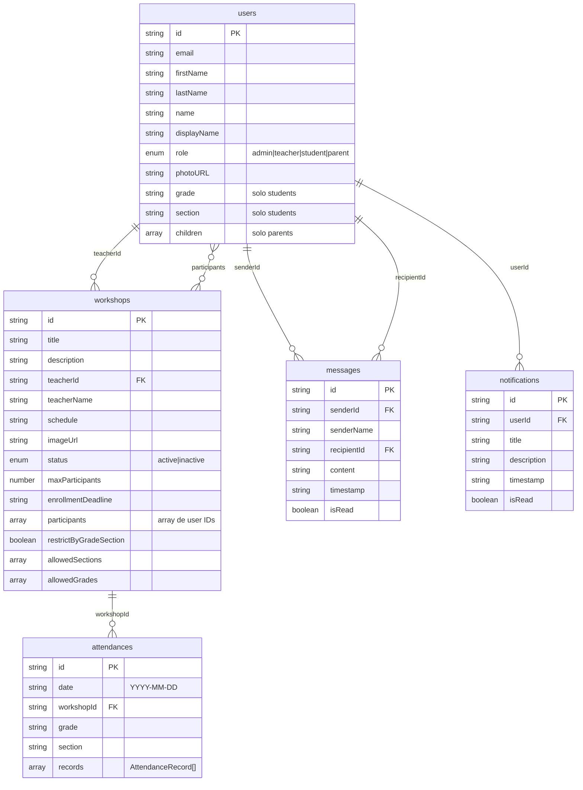

# Diagrama de Base de Datos - SIGTE

## Modelo de Datos en Firestore



## Descripción de Colecciones

### 📁 users
Almacena todos los usuarios del sistema (administradores, profesores, estudiantes y padres).

**Campos principales:**
- `role`: Define el tipo de usuario y sus permisos
- `grade` y `section`: Solo para estudiantes
- `children`: Solo para padres, array de objetos con `{id, name}`

### 📁 workshops
Talleres disponibles en el sistema.

**Campos principales:**
- `participants`: Array de IDs de usuarios inscritos
- `restrictByGradeSection`: Si es `true`, solo estudiantes de `allowedSections` pueden inscribirse
- `status`: `active` o `inactive`

### 📁 attendances
Registros de asistencia por taller y fecha.

**Estructura de records:**
```typescript
{
  studentId: string,
  studentName: string,
  status: 'present' | 'late' | 'justified' | 'absent' | 'none',
  registeredDate?: string,
  registeredTime?: string
}
```

### 📁 messages
Mensajes entre usuarios del sistema.

**Características:**
- Comunicación bidireccional
- Estado de lectura (`isRead`)
- Timestamp en formato ISO

### 📁 notifications
Notificaciones para usuarios.

**Características:**
- Asociadas a un usuario específico
- Estado de lectura
- Timestamp en formato ISO

## Reglas de Negocio

### Inscripción en Talleres
1. El estudiante debe estar autenticado
2. El taller debe estar `active`
3. No debe estar lleno (`participants.length < maxParticipants`)
4. La fecha límite no debe haber pasado
5. Si `restrictByGradeSection = true`, la sección del estudiante debe estar en `allowedSections`

### Roles y Permisos
- **admin**: Acceso total al sistema
- **teacher**: Puede gestionar sus talleres y tomar asistencia
- **student**: Puede inscribirse en talleres y ver su información
- **parent**: Puede ver información de sus hijos

## Índices Recomendados

Para optimizar las consultas en Firestore:

```
workshops:
  - teacherId (Ascending)
  - status (Ascending)
  
attendances:
  - workshopId (Ascending), date (Descending)
  - date (Descending)

messages:
  - senderId (Ascending), timestamp (Descending)
  - recipientId (Ascending), timestamp (Descending)

notifications:
  - userId (Ascending), timestamp (Descending)
```
